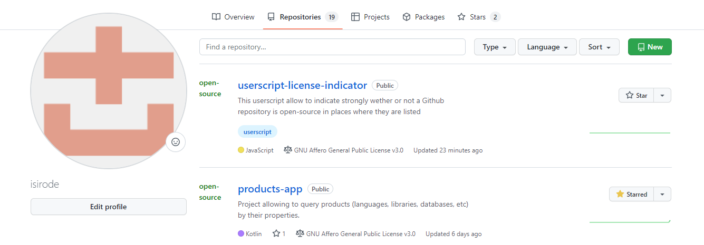

# userscript-license-indicator

This userscript allow to indicate strongly wether or not a Github repository is open-source in places where they are listed.

## Features

- [x] Indicate in green or red (+ bold) wether a repository is open-source or not in Github (search, user homepage, user repositories)

## Developer

### TODO

- [ ] Support Gitlab
- [ ] Add and icon
- [ ] Modify the rendering of the license indicator of the git website
- [ ] Setup a setting to modify the update setInterval
